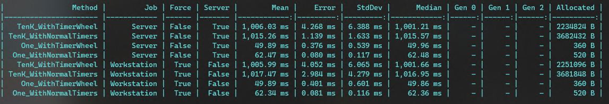

# Yet Another Timer Wheel implementation on csharp

This repo contains an implementation of a Simple Timer Wheel as defined by [https://blog.acolyer.org/2015/11/23/hashed-and-hierarchical-timing-wheels/](https://blog.acolyer.org/2015/11/23/hashed-and-hierarchical-timing-wheels/).

> The basic timing wheel approach is applicable when all timers have a maximum period of no more than MaxInterval, and we can construct a circular buffer with MaxInterval slots (each representing one tick). The current time is represented by an index into the buffer. To insert a timer that expires j < MaxInterval time units in the future, we move j slots around the ring and add the timer to a list of timers held in that slot. Every tick, the current time index moves one slot around the ring and does expiry processing on all timers held in the new slot. Start, stop, and per-tick bookkeeping are all O(1).

Basically, in an application that has multiple tasks that rely on independent timers, a Timer Wheel is an optimization that allows for a single timer to be used and all independent tasks to hook into it, reducing the required allocations (which reduces the eventual GC and CPU).

## Usage

Creation of the wheel requires the *resolution* of each wheel's bucket and the amount of *buckets*, which define which is the *MaxInterval*.

```csharp
TimerWheel wheel = TimerWheel.CreateTimerWheel(resolution: TimeSpan.FromMilliseconds(50), buckets: 20);
```

Once a wheel is created, new timers can be requested by specifying the *timeout in milliseconds* for that particular timer. Then, a call to `StartTimerAsync` will return a `Task` that resolves once the timeout is up:

```csharp
TimerWheelTimer timer = wheel.CreateTimer(timeout:TimeSpan.FromMilliseconds(100));
await timer.StartTimerAsync();
```

### Disposal

The `TimerWheel` instance is disposable and should be disposed after it has been used or the parent's scope is disposed.

## Tests

The repo includes the [unit tests](./test) associated with the project.

## Benchmark

The repo includes [BenchmarkDotNet benchmarks](./perf) that compare the performance of the wheel versus using `System.Threading.Timer` directly. The amount of allocated memory is less than having to maintain individual Timers for a particular scenario.


